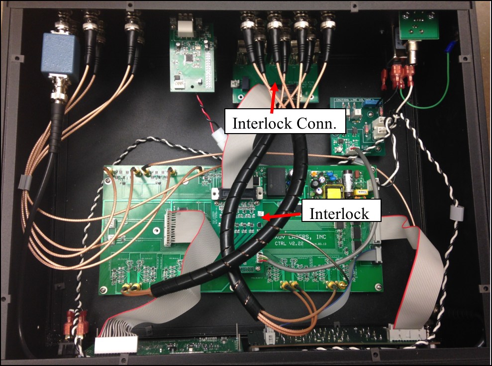

# FPGA Based Laser Controller UI

This is a C project that runs on FPGA to provide a laser controller UI

## Web Controller UI
And this controller can also be used on any html-5 supported browser.

* [Design Report](photos/Web_UI.pdf) 

## Deployment
No deploy, install instruction provided. 
Excluded used for private research purpose

## Built With

* [Quartus](https://www.altera.com/downloads/download-center.html) - The FPGA platform
* [LAMP](https://bitnami.com/stack/lamp) - Web Server

## Authors

* **Ang Li** - *Initial work* - [Ang Li](https://github.com/leonmz)

## Acknowledgments

* Ce Guo
* Daniel Ball
* Derrick Zhou
